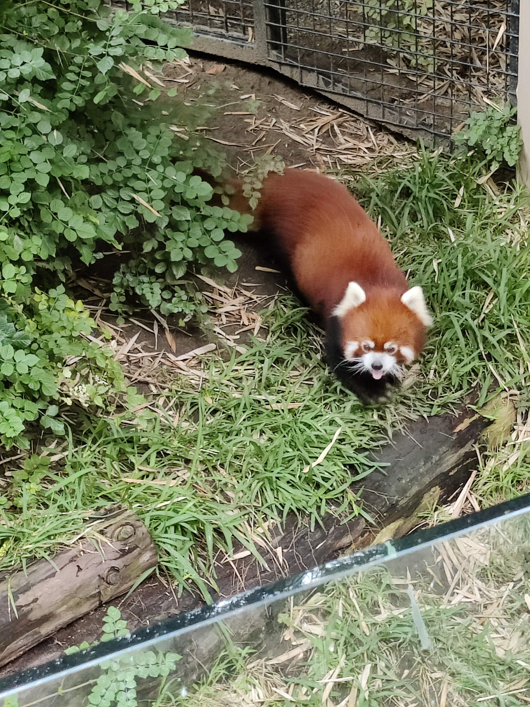

# Panda3DS
[](https://github.com/wheremyfoodat/Panda3DS/actions/workflows/Windows_Build.yml) [](https://github.com/wheremyfoodat/Panda3DS/actions/workflows/MacOS_Build.yml) [](https://github.com/wheremyfoodat/Panda3DS/actions/workflows/Linux_Build.yml)

Panda3DS is an HLE, red-panda-themed Nintendo 3DS emulator written in C++ which started out as a fun project out of curiosity, but evolved into something that can sort of play games!

# Discussion
Join our Discord server by pressing on the banner below!

[](https://discord.gg/ZYbugsEmsw)

  

# Compatibility
Panda3DS is still in the early stages of development. Many games boot, many don't. Most games have at least some hilariously broken graphics, audio is not supported, performance leaves a bit to be desired mainly thanks to lack of shader acceleration, and most QoL features (including a GUI) are missing.

In addition, some games don't quiiite work with the upstream code. A lot of them might need some panics in the source code to be commented out before they work, etc. However, just the fact things can work as well as they do now is promising in itself.

# Why?
The 3DS emulation scene is already pretty mature, with offerings such as [Citra](https://github.com/citra-emu/citra) which can offer a great playing experience for most games in the library, [Corgi3DS](https://github.com/PSI-Rockin/Corgi3DS), an innovative LLE emulator, or [Mikage](https://mikage.app/). However, there's always room for more emulators! While Panda3DS was initially a mere curiosity, there's many different concepts I would like to explore with it in the future, such as:

- Virtualization. What motivated the creation of this emulator was actually a discussion on whether it is possible to get fast 3DS emulation on low-end hardware such as the Raspberry Pi 4, using the KVM API. At the moment, Panda3DS is powered by dynarmic rather than using virtualization, but this is definitely a concept I want to explore in the future.

- Debugging, reverse engineering and modding tools. While contributing to [PCSX-Redux](https://github.com/grumpycoders/pcsx-redux) and collaborating with the other developers, I had the chance to find out how useful tools like these can be. They can serve as indispensable tools for the homebrew devs, modders, reverse engineers, as well as emulator developers themselves. Some tools can even become fun toys the casual user can mess around with. As such, I think they can really improve the experience in a project like this. Of course, I'd like to thank @nicolasnoble and the entire Redux team for helping me learn the value of these tools, as well as making me improve as a programmer.

- Trying out various other unique features, such as different graphics or audio enhancements, or supporting other niche things such as amiibo.

- Fun. Writing code is fun and I strongly encourage anyone to do it.

Keep in mind, these are all long-term plans. Until then, the main focus is just improving compatibility

# How to build
Panda3DS compiles on Windows, Linux and MacOS, without needing to download any system dependencies.

All you need is CMake and a generator of your choice (Make, Visual Studio, Ninja, etc). Simply clone the repo recursively and build it like your average CMake project.

```sh
git clone https://github.com/wheremyfoodat/Panda3DS --recursive

cd Panda3DS && mkdir build && cd build
cmake .. -DCMAKE_BUILD_TYPE=Release # Set up compilers etc here if you'd like

<Invoke Make, Visual Studio, or whatever you would like to use>
```

# How to use
Simply drag and drop a ROM to the executable if supported, or invoke the executable from the command line with the path to the ROM as the first argument.

## Controls
- Up button	W
- Down button	S
- Left button	A
- Right button	D
- A button	L
- B button	K
- X button	O
- Y button	I
- L button	Q
- R button	P
- Start button	Enter
- Select button	Backspace

# Acknowledgements
- [3DBrew](https://www.3dbrew.org/wiki/Main_Page), a wiki full of 3DS information and the main source of documentation used.
- [GBATek](https://www.problemkaputt.de/gbatek.htm#3dsreference), a GBA, DS and 3DS reference which provided insights on some pieces of hardware as well as neatly documenting things like certain file formats used in games.
- [Libctru](https://github.com/devkitPro/libctru), the most well-known 3DS homebrew SDK. Used for developing test ROMs, as well as a source of documentation thanks to its doxygen wiki.

- [Citra](https://github.com/citra-emu/citra), an HLE 3DS emulator. Very useful as a reference, with some code snippets inspired or adapted from it.
- [3dmoo](https://github.com/plutooo/3dmoo), an HLE 3DS emulator which helped similarly to Citra
- [Corgi3DS](https://github.com/PSI-Rockin/Corgi3DS), an LLE 3DS emulator which both served as an inspiration, as well as a nice source of documentation for some PICA200-related things

# Sister Projects
- [PCSX-Redux](https://github.com/grumpycoders/pcsx-redux): A PlayStation 1 emulator targetting developers, reverse engineers and regular PS1 fans alike
- [SkyEmu](https://github.com/skylersaleh/SkyEmu): A seagull-themed low-level GameBoy, GameBoy Color, GameBoy Advance and Nintendo DS emulator that is designed to be easy to use, cross platform and accurate.
- [NanoBoyAdvance](https://github.com/nba-emu/NanoBoyAdvance): A Game Boy Advance emulator focusing on hardware research and cycle-accurate emulation
- [Dust](https://github.com/kelpsyberry/dust): Nintendo DS emulator for desktop devices and the web
- [MelonDS](https://github.com/melonDS-emu/melonDS): "DS emulator, sorta" - Arisotura
- [Kaizen](https://github.com/SimoneN64/Kaizen): Experimental work-in-progress low-level N64 emulator

# Support
If you find this project exciting and want to support the founder, check out [his Patreon page](https://www.patreon.com/wheremyfoodat)
<br>
Keep in mind, funding is only aimed to cover various life costs and support development. Panda3DS is a free product and on no occasion will official builds ever be made private or limited to sponsors! Any donation is much appreciated!

Nintendo 3DS is a registered trademark of Nintendo Co., Ltd.


Here's a panda it go blep
